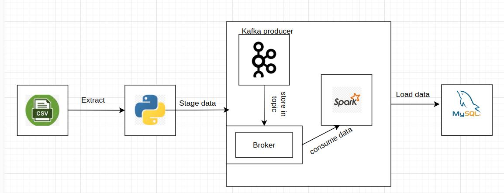

# energy-consumption

## Table of content
1. [Project overview](#Project-overview)
2. [Technologies Used](#Technologies-Used)
3. [ETL Process](#ELT-process)
4. [Setup and Installation](#Setup-and-Installation)

## Project overview
**Energy consumption** is focused on realtime proccessing data for energy usage in homes during the year..
It's categorized according to different machines in the home.

## Technologies used
- **Docker** to containerize the project with eazy deploymnet.
- **SQL server** To load data in permanent storage.
- **Kafka** to hangle realtime data and streaming process.
- **Spark streaming** to consume the data from kafka topic and load it to SQL server.

## ETL Process

